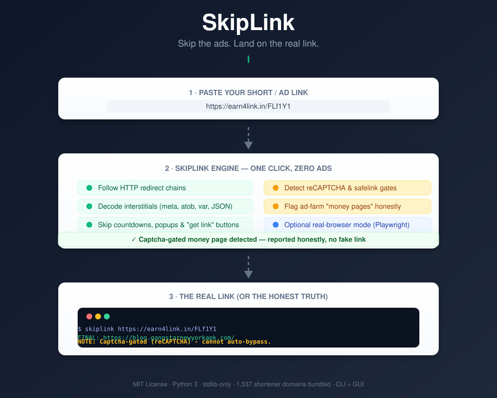

<p align="center">
  
</p>

# SkipLink

**Skip the ads. Land on the real link.**

SkipLink is a one-click bypass for ad-driven **"shorten-and-earn"** URL
shorteners (adf.ly, shorte.st, linkvertise, shrinkearn, clk.sh, fc.lc,
earn4link.in, and thousands more). Paste a short link, hit **Bypass**, and
get the real destination URL instantly — **no ads, no 5-second timers, no
clicks, no fake pages**.

> It works over plain HTTP only: it never renders an ad, never runs an
> interstitial, and never executes JavaScript. It simply reads the
> destination that the shortener's own page already contains and follows the
> redirect chain straight to it.

## Features

- **One-click GUI** (Tkinter) — paste, press Enter, copy or open the final link.
- **CLI** — resolve one link or a whole file of links, JSON output for scripting.
- **Multi-layer resolution** — follows unlimited chains of redirects *and*
  interstitial pages (a shortener pointing at another shortener keeps resolving).
- **Zero dependencies** — pure Python standard library. Works even without pip.
- **1,537 known shortener domains** bundled for detection.
- **Honest about walls** — detects Google reCAPTCHA / safelink verification
  gates and ad-farm "money pages", and tells you so instead of guessing.
- **Optional real-browser mode** (Playwright) for JS-countdown shorteners
  and "get link" buttons that only release the destination in a live browser.
- Decodes the usual tricks: `meta refresh`, `location.href`, `var link`,
  `atob(...)` base64, `unescape(...)`, skip-button anchors, JSON APIs and
  plain-text destinations.

## Install

### Prebuilt app (Windows / macOS / Linux)

Grab the ready-made executables from the
[Releases page](https://github.com/akashmark8-cloud/skiplink/releases):

| Platform | File | Notes |
| --- | --- | --- |
| Windows | `skiplink-gui.exe` | double-click for the app |
| Windows | `skiplink.exe` | command line |
| Linux | `skiplink-gui` | double-click, or run from a terminal |
| Linux | `skiplink` | command line |

> macOS: build support can be re-enabled (see `.github/workflows/build.yml`),
> but the binaries are unsigned (no Apple Developer account), so the first
> launch would need **right-click → Open**. Every build is produced
> automatically by GitHub Actions from the source on every `v*` tag.

### From source

```bash
git clone https://github.com/akashmark8-cloud/skiplink.git
cd skiplink
python -m pip install -e .          # optional: gives you the `skiplink` command
```

Or just run it directly — no install needed:

```bash
python main.py "https://adf.ly/AbCdEf"
python gui.py
```

### Optional: browser mode (Playwright)

For hardened shorteners that only reveal the destination when JavaScript runs:

```bash
pip install -r requirements-browser.txt
playwright install chromium
```

Then use `--browser` / the GUI's "Use browser" checkbox.

## Usage

### CLI

```bash
# resolve one link
python main.py "https://adf.ly/AbCdEf"

# resolve several links at once
python main.py "https://shorte.st/x" "https://tinyurl.com/y"

# resolve a file full of links (one per line, '#' = comment)
python main.py -f links.txt

# open the final link in your browser
python main.py -o "https://bit.ly/xyz"

# copy the final link to the clipboard
python main.py -c "https://is.gd/abc"

# machine-readable output
python main.py -j "https://cutt.ly/uvw" "https://gg.gg/pqr"

# real-browser mode for JS-gated links
python main.py -b "https://ouo.io/xyz"

# version / domain list
python main.py -V
python main.py --list
```

Example output:

```
[https://earn4link.in/FLf1Y1] (known shortener)
   1. [embedded ] https://earn4link.in/FLf1Y1  (HTTP 200)
   2. [redirect ] http://open2get.in/FLf1Y1  (HTTP 302)
   3. [redirect ] https://blog.gangstarnewyorkapk.com/myphp.php?id=FLf1Y1&site=e4l  (HTTP 302)
   4. [final    ] https://blog.gangstarnewyorkapk.com/  (HTTP 200)

FINAL: https://blog.gangstarnewyorkapk.com/
NOTE:  Captcha-gated (Google reCAPTCHA / human verification). The final link
       is only released to a human in a real browser; no automated tool can
       bypass it.
```

### GUI

```bash
python gui.py
```

1. Paste your short link into the box (or click **Paste from clipboard**).
2. Press **Enter** or click **Bypass**.
3. The full resolution chain is shown. Click **Open final** to open it in your
   browser or **Copy final** to put it on the clipboard.
4. Tick **Use browser (Playwright)** for links that need a real browser.

## As a library

```python
from skiplink import resolve

result = resolve("https://adf.ly/AbCdEf")
print(result["final"])          # the destination URL
for hop in result["chain"]:
    print(hop["url"], hop["status"], hop["kind"])
if result["note"]:
    print("NOTE:", result["note"])          # e.g. captcha-gated / money page
```

## How it works

1. Send one HTTP request (a real-browser `User-Agent`, cookies kept across
   hops) to the short link, **without following redirects automatically**.
2. If the response is a redirect (`301/302/303/307/308`), follow the
   `Location` header. Repeat.
3. If the response is an interstitial ad page, scan its HTML/JSON for the
   embedded destination:
   - `<meta http-equiv="refresh" ...>`
   - `window.location` / `location.href` / `window.open(...)`
   - `var link = "..."` / `var url = "..."` style assignments
   - `atob("...")` and `unescape("...")` encoded URLs
   - skip/continue button anchors, `data-*` attributes, `iframe` src
   - JSON API responses with `url` / `link` / `destination` keys
   - a bare URL in plain-text responses
4. Ignore obvious ad/tracker domains and follow the real destination.
5. Repeat until no further redirect or embedded link is found, then classify
   the final page: captcha gate, safelink gate, or ad-farm money page — and
   say so instead of guessing.
6. **Browser mode**: drive a headless Chromium via Playwright, wait out
   countdowns, auto-click skip/continue/get-link elements, and read the URL
   that a human would actually land on.

## Project layout

```
skiplink/
├── main.py               # CLI entry point
├── gui.py                # run the one-click GUI directly
├── launcher.py           # PyInstaller entry point (GUI / CLI in one binary)
├── .github/workflows/build.yml  # builds Windows/macOS/Linux binaries per tag
├── skiplink/
│   ├── __init__.py
│   ├── cli.py            # command line interface
│   ├── core.py           # resolution engine + wall detection (stdlib only)
│   ├── browser.py        # optional Playwright browser mode
│   ├── gui.py            # Tkinter GUI
│   ├── clipboard.py      # copy-to-clipboard helper
│   ├── __main__.py       # python -m skiplink
│   └── data/
│       └── shortener_domains.txt   # 1,537 known shortener domains
├── docs/demo.svg         # overview diagram
├── tests/test_core.py    # unit tests (local HTTP server, no network)
├── requirements.txt      # stdlib only, no installs needed
├── requirements-browser.txt  # optional Playwright extra
├── pyproject.toml
└── LICENSE               # MIT
```

## Tests

```bash
python -m unittest discover -s tests -v
```

The tests spin up a local HTTP server, so they run offline.

## Building the app yourself

The released executables are built with [PyInstaller](https://pyinstaller.org/)
by GitHub Actions (see `.github/workflows/build.yml`) — no cross-compiling
needed: each OS builds its own native binary. Locally you can do the same:

```bash
pip install pyinstaller
pyinstaller --onefile --windowed --name skiplink-gui \
  --add-data "skiplink/data/shortener_domains.txt:skiplink/data" launcher.py
```

- `launcher.py` is a single entry point: no arguments opens the GUI, URL
  arguments run the CLI.
- To create a new release, push a tag: `git tag v1.2.0 && git push origin v1.2.0`
  — the workflow builds for all four platforms and attaches them to the Release.

## License

MIT. See [LICENSE](LICENSE). Copyright (c) 2026 akashmark8-cloud.

## Disclaimer

This tool resolves short links to their destination. Use it only for
legitimate purposes: checking where a link really goes before clicking,
security research, link hygiene, and personal convenience. Respect the terms
of service of the services you use, and be aware that link-rot means many
shortener domains in the bundled list may have changed owners or shut down.
